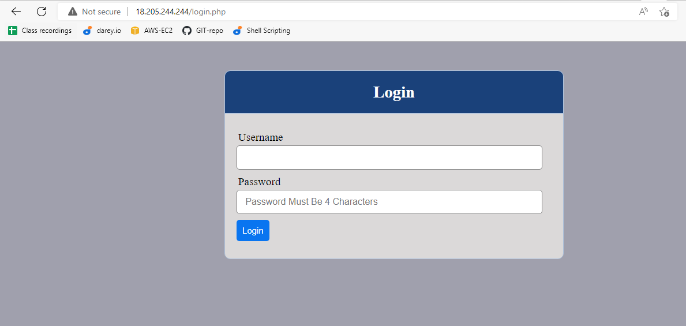

# Project 7

In this project I will implement a solution that consists of following components:

1. **Infrastructure:** AWS
2. **Webserver Linux:** Red Hat Enterprise Linux 8
3. **Database Server:** Ubuntu 20.04 + MySQL
4. **Storage Server:** Red Hat Enterprise Linux 8 + NFS Server
5. **Programming Language:** PHP
6. **Code Repository:** GitHub


**Project Architecture Diagram**
 

## Step 1 – Prepare NFS Server

* Spin up an EC2 instance with Red Hart OS as NFS server

* Follow up by adding 2 volumes in the same AZ as the NFS Server, each with 8 GB storage space

* Then used ***lsblk*** command to inspect the block devices that are attached to my NFS server

`lsblk`


* Used the ***gdisk utility*** to create a single partition on each of the disks ***xvdb, xvdc***

`sudo gdisk /dev/xvdb`

`sudo gdisk /dev/xvdc`


* Installed ***lvm2*** package

`sudo yum install lvm2`


* Then checked for available partitions

`sudo lvmdiskscan`


* With `sudo pvcreate /dev/xvdb1 /dev/xvdc1` command, set up the two blocks as physical volumes for LVM

* And the verify with `sudo pvs`


* created nfs volume group and verified

`sudo vgcreate nfs-vg /dev/xvdb1 /dev/xvdc1`


`sudo vgdisplay`


Using lvcreate utility to create 3 logical volumes ***lv-opt , lv-apps and lv-logs*** with an allocation of 5 GB on each

`sudo lvcreate -n lv-apps -L 5G nfs-vg`

`sudo lvcreate -n lv-opt -L 5G nfs-vg` 

`sudo lvcreate -n lv-logs -L 5G nfs-vg`

* Then verified with:

`sudo lvs`


* Created mount points on ***/mnt directory*** for the logical volumes as follow:


`sudo mkdir /mnt/apps /mnt/logs /mnt/opt`


* As in the documentation, I used ***mkfs.xfs*** to format the logical volumes


`sudo mkfs -t xfs /dev/nfs-vg/lv-apps`


`sudo mkfs -t xfs /dev/nfs-vg/lv-logs`

`sudo mkfs -t xfs /dev/nfs-vg/lv-opt`


-- Mount lv-apps on /mnt/apps – ***To be used by webservers***

-- Mount lv-logs on /mnt/logs – ***To be used by webserver logs***

-- Mount lv-opt on /mnt/opt – ***To be used by Jenkins server***


`sudo mount /dev/nfs-vg/lv-apps /mnt/apps`


`sudo mount /dev/nfs-vg/lv-logs /mnt/logs`


`sudo mount /dev/nfs-vg/lv-opt /mnt/opt`


* Update ***/etc/fstab*** file so that the mount for consistency after server restart 

1. run: `sudo blkid /dev/nfs-vg/*`

2. Copy the UUID of the device to update in the /etc/fstab file

3. `sudo vi /etc/fstab`

4. Update /etc/fstab by pasting the UUID copied above.


Did `sudo less /etc/fstab` to see added UUID


* Test the configuration and reload

`sudo mount -a`

`sudo systemctl daemon-reload`

Confirmed setup with: 
`df -h`


* Install NFS server, configure it to start on reboot and make sure it is u and running


`sudo yum -y update`

`sudo yum install nfs-utils -y`

`sudo systemctl start nfs-server.service`

`sudo systemctl enable nfs-server.service`

`sudo systemctl status nfs-server.service`


***NFS server running active***


* Set up permission that will allow our Web servers to read, write and execute files on NFS:

`sudo chown -R nobody: /mnt/apps`

`sudo chown -R nobody: /mnt/logs`

`sudo chown -R nobody: /mnt/opt`

* Read, write, execute permission

`sudo chmod -R 777 /mnt/apps`

`sudo chmod -R 777 /mnt/logs`

`sudo chmod -R 777 /mnt/opt`

* Restart NFS server

`sudo systemctl restart nfs-server.service`


* Next, configure access to NFS for clients within the same subnet


* Export the mounts for my webservers’ subnet CIDR (172.31.16.0/20) to connect as clients.

* Configure access to NFS for clients within the same subnet. using vi editor,input my subnet IPv4 cidr.

`sudo vi /etc/exports`

```

/mnt/apps <Subnet-CIDR>(rw,sync,no_all_squash,no_root_squash)

/mnt/logs <Subnet-CIDR>(rw,sync,no_all_squash,no_root_squash)

/mnt/opt <Subnet-CIDR>(rw,sync,no_all_squash,no_root_squash)

```


* Do `sudo exportfs -arv`


* Check which port is used by NFS and open it using Security Groups (add new Inbound Rule)

`rpcinfo -p | grep nfs`


*  In order for NFS server to be accessible from clients, I updated the inbound rule to open following ports: ***TCP 111, UDP 111, UDP 2049, TCP 2049***


## Step 2 - Configure the database server
Spin up an Ubuntu DB server 

* Install ***MySQL server***
* Create a database and name it ***tooling***
* Create a database user and name it ***webaccess***
* Grant permission to ***webaccess*** user on ***tooling*** database to do anything only from the webservers ***subnet cidr***

`sudo mysql`

`sudo systemctl status mysql.service`


```

CREATE DATABASE tooling;

CREATE USER 'webaccess'@'%' Identified with mysql_Native_password BY 'password';

GRANT ALL ON tooling.* TO 'webaccess'@'%';

FLUSH PRIVILEGES;

SHOW DATABASES;

SELECT USER FROM mysql.user;

exit

```


* Updated bind-address

`sudo vi /etc/mysql/mysql.conf.d/mysqld.cnf`


* Restart mysql

`sudo systemctl restart mysql`


## Setting up web-servers 


I launched three new EC2 instance with RHEL 8 Operating System

Then, installed NFS client on each

`sudo yum install nfs-utils nfs4-acl-tools -y`


After which I attempted to mount ***/var/www/*** and target the NFS server’s export for apps

`sudo mkdir /var/www`

`sudo mount -t nfs -o rw,nosuid <NFS-Server-Private-IP-Address>:/mnt/apps /var/www`


i.e 

`sudo mount -t nfs -o rw,nosuid 172.31.82.141:/mnt/apps /var/www`

Succesfully mounted for all three servers:
* Verify that NFS was mounted successfully by running df -h. 


Make sure that the changes will persist on Web Server after reboot:

`sudo vi /etc/fstab`

* add following line

`<NFS-Server-Private-IP-Address>:/mnt/apps /var/www nfs defaults 0 0`

i.e

`172.31.82.141:/mnt/apps /var/www nfs defaults 0 0`


* Install ***Remi’s repository, Apache and PHP***

`sudo yum install httpd -y`


`sudo dnf install https://dl.fedoraproject.org/pub/epel/epel-release-latest-8.noarch.rpm`


`sudo dnf install dnf-utils http://rpms.remirepo.net/enterprise/remi-release-8.rpm`


`sudo dnf module reset php`


`sudo dnf module enable php:remi-7.4`


`sudo dnf install php php-opcache php-gd php-curl php-mysqlnd`


`sudo systemctl start php-fpm`


`sudo systemctl enable php-fpm`


`setsebool -P httpd_execmem 1`


* I verified that Apache files and directories are available on the Web Server in ***/var/www*** and also on the NFS server in ***/mnt/apps***. 


Also, I could see the same files – this means NFS is mounted correctly. I tested by creating a a new file touch ***project.txt*** from one server and checked to confirm it replicated, same file was accessible from other Web Servers.


* Fork the tooling source code from ***Darey.io*** Github Account 


`sudo yum install git`


`git clone https://github.com/darey-io/tooling.git`


With the following commands, deployed the tooling website’s code to the Webserver. Ensure that the ***html*** folder from the repository is deployed to ***/var/www/html***


* `cd /var/www/html directory`


* move every file/folder in tooling folder which is present in the ***/var/www/html*** directory to the current directory ***"html"***

`sudo mv tooling/* .`

* After moving all the content in the ***tooling*** folder to the ***html*** directory, then, delete the empty tooling folder in html folder


`sudo rm -r tooling`

* Then, move every file/folder in ***html*** folder which is currently present in the ***/var/www/html*** directory to the current directory ***"html"***


`sudo mv html/* .`


* After all the content in the ***html*** folder has been moved to ***var/www/html*** directory, then, delete the empty ***html*** folder in ***var/www/html***

`sudo rm -r html`


* Install mysql on all my web servers


`sudo yum install mysql`

* Using Vi editor, update the website’s configuration to connect to my database in ***/var/www/html/functions.php*** file by inputting my DB private IP, DB user name, DB password and DB name.


`sudo vi funtions.php`


* Apply tooling-db.sql script to my database using this command below:


mysql -h <databse-private-ip> -u <db-username> -p <db-pasword> < tooling-db.sql 


`sudo mysql -h 172.31.36.58 -u webaccess -ppassword tooling < tooling-db.sql`


`sudo mysql -h 172.31.85.154 -u webaccess -ppassword tooling` 


`show databases;`


`select * from users;`


* Disable SELinux in all webserver


`sudo setenforce 0`


* Make this change permanent – open following config file in all webserver


`sudo vi /etc/sysconfig/selinux`


and set ***SELINUX=disabled***. then restrt httpd with command below:


`sudo systemctl restart httpd`


Open the website in my browser

http://<Web-Server-Public-IP-Address-or-Public-DNS-Name>/index.php 


### Ensure login into the website




***Its project 7 success***  🙂


